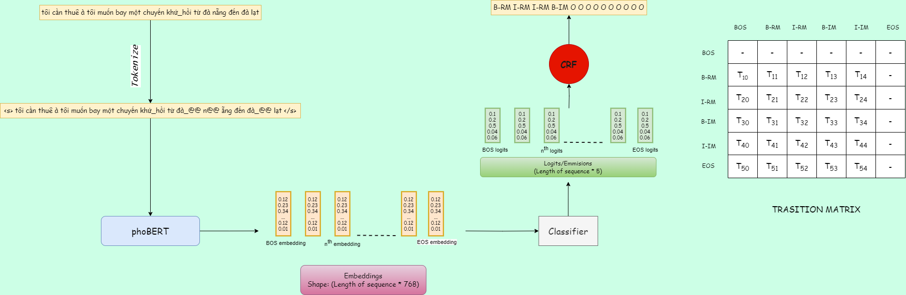

# Vietnamese_Disfluency_Detection
## Introduction
- This is my project on investigating ways to improve the performances of Vietnamese Disfluency Detection, a very new task that first published in this [artical](https://aclanthology.org/2022.wnut-1.21/).
- This project proposed two ways to improve the performances: Data-Augmentation and Condition Random Field-Plugin (CRF-Plugin).
- As this [paper](https://arxiv.org/pdf/2209.08359.pdf) pointed out, some popular SLU downstream tasks like Intent-Detection and Slot-Filling - which is trained on fluent utterances - is affected by disfluency utterances. So the improvement on the Vietnamese Disfluency Detection can help these SLU models more robust in practice.
- In Data-Augmentation technique, each type of entities tags (RM and IM) are grouped into a *neighborhood* if their cosine-similarity are greater than ER_threshold (ER: Entity Replacement). Then the sentence of a specific entity are replaced by its *neighbors* from *neighborhood*, but if the cosine-similarity between the original sentence and original one are above the SE_threshold (SE: Sentence Evaluation).

- The CRF technique introduce the transition between labels. This behavior help modelling the conditional probabilities between labels given the observed sequence, taking into account the contextual information surrounding each token. When predicting, instead of making local, independent decisions for each token, CRFs consider the entire sequence and select the label sequence that maximizes the joint probability distribution. This global optimization helps ensure consistency and coherence in the predicted labels.


## Installation
- Clone this repo
```bash
git clone https://github.com/LeTruongVu2k1/Vietnamese_Disfluency_Detection
```

- Download dependencies:
```bash
pip install -r 'Vietnamese_Disfluency_Detection/requirements.txt'
```

## Preparing Data
- The dataset used here is [PhoATIS_Disfluency](https://github.com/vinairesearch/phoatis_disfluency) - a dataset created for investigating the influence of disfluency detection on the downstream intent detection and slot filling tasks.
- Run the `data_loader.py` below to clone the dataset's repository and convert them into **.pkl** files (to be loaded later by HuggingFace's pickled loading script) 
```bash
python VietNamese_Disfluency_Detection/data_loader.py -data_dir \
                                                      -src_parent_dir "PhoDisfluency/data/word-level" \
                                                      -dst_parent_dir "data"
```
- You can adjust the arguments by adding `-h` flags. But if you don't adjust any arguments, then it will structure your data in the directory named **data**:
    ```
    data
    ├── train
    │   ├── data.pkl
    ├── dev
    │   ├── data.pkl
    ├── test
    │   ├── data.pkl
    ```
- Please note that the dataset used here is **word-level**, as it is pointed out from this [artical](https://aclanthology.org/2022.wnut-1.21/) that model trained with **word-level** will get better performance than **syllable-level**.
## Training
- To train the model using Data-Agumentation technique:
```bash
python VietNamese_Disfluency_Detection/train.py -training_version 'DA' \
                                                -data_dir 'data' \
                                                -output_dir 'DA_version' \
                                                -num_train_epochs 50 \
                                                -pretrained_feature_extraction_checkpoint 'vinai/phobert-base' \
                                                -pretrained_sentence_extraction_checkpoint 'sentence-transformers/paraphrase-MiniLM-L6-v2' \
                                                -ER_threshold 0.8 \
                                                -SE_threshold 0.85 
```

- To train the model using CRF technique:
```bash
python VietNamese_Disfluency_Detection/train.py -training_version 'CRF' \
                                                -data_dir 'data' \
                                                -output_dir 'CRF_version' \
                                                -num_train_epochs 50 \
                                                -hidden_dropout 0.2 \
                                                -attention_dropout 0.4
```
   
- To use both:
```bash
python VietNamese_Disfluency_Detection/train.py -training_version 'BOTH' \
                                                -data_dir 'data' \
                                                -output_dir 'BOTH_version' \
                                                -num_train_epochs 50 
```

**Notes**
- If you've not stored your data in **data_dir** (the default directory when running the `data_loader.py` above), then you have to specify your data's directory in `-data_dir`.
- You can adjust more training's arguments, please use `-h` flag for more information.
